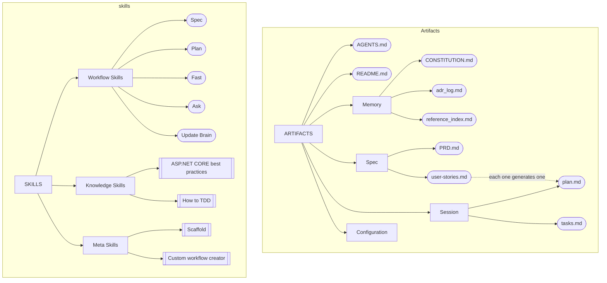

# JAIBA Framework maintenance instructions for Agents

> **For repository maintainers:** Replace every bracketed placeholder
> (`[like this]`) with real project values. Until then, the agent
> should treat placeholders as *to be filled*, not as literal
> requirements, and ask before proceeding.

> **Meta-instruction for the agent:** This document is the authority
> on *project identity, architecture, scope, planning conventions,
> and the Quality Gate*. Read it before any substantive planning or
> implementation. `AGENTS.md` defines your general behavior; this
> file defines what applies to **this project specifically**. On
> conflict over project facts, this document wins.

## 1. What

- **Project name:** JAIBA Framework
- **Description:** Joint-Operations Artificial Intelligence Behavioral Architecture framework. A fast, secure, harnessed framework for AI Augmented Software development
- **Status:** MVP

## 2. How

- **Primary language:** Agent Skills, Markdown

## 3. Why

- **Business objective:** Provide a secure, standarized way of co working with AI Agents. Read README.md for information

## 4. File structure

### Framework composition




### File hierarchy

The final output of this framework are skills, template artifacts will be packaged within this skills

```
└── skills
    ├── planning
    │   ├── assets
    │   │   ├── plan-template.md
    │   │   ├── tasks-template.md
    │   │   ├── walkthrough-template.md
    │   │   └── plan-summary-template.md
    │   ├── references     (one per mode: define, execute, summarize, cleanup)
    │   └── scripts
    │       └── cleanup.sh
    ├── specification
    │   ├── assets
    │   │   ├── prd-template.md
    │   │   ├── user-stories-template.md
    │   │   └── spec-archive-template.md
    │   ├── references     (one per mode: brainstorm, define, archive)
    │   └── scripts
    │       └── archive.sh
    ├── ask
    ├── fast
    ├── update-brain
    │   ├── assets
    │   │   ├── constitution-template.md
    │   │   ├── adr-log-template.md
    │   │   ├── reference-index-template.md
    │   │   └── readme-skeleton.md
    │   └── references     (one per mode: initialize, update)
    ├── scaffold           (lays the .ai/ skeleton, then invokes
    │                       update-brain:initialize — owns no templates)
    ├── create-knowledge
    └── doctor
```

> The memory artifact templates are owned by `update-brain` (the only
> skill that writes `.ai/memory/`). `scaffold` does not carry its own
> copies: it creates the `.ai/` skeleton and hands off to
> `update-brain:initialize`, which materializes the brain from those
> templates.


## 5. Project status

Read project status and tasks at `.ai/session/state.md` when requested with a full plan.

## 6. Behavior

To save tokens, use `caveman` skill for communication
