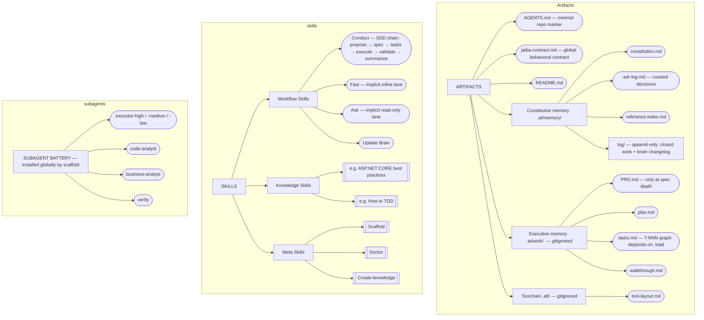

# JAIBA Framework maintenance instructions for Agents

> **For repository maintainers:** Replace every bracketed placeholder
> (`[like this]`) with real project values. Until then, the agent
> should treat placeholders as *to be filled*, not as literal
> requirements, and ask before proceeding.

> **Meta-instruction for the agent:** This document is the authority
> on *project identity, architecture, scope, planning conventions,
> and the Quality Gate*. Read it before any substantive planning or
> implementation. `AGENTS.md` defines your general behavior; this
> file defines what applies to **this project specifically**. On
> conflict over project facts, this document wins.

## 1. What

- **Project name:** JAIBA Framework
- **Description:** Joint-Operations Artificial Intelligence Behavioral Architecture framework. A fast, secure, harnessed framework for AI Augmented Software development
- **Status:** MVP

## 2. How

- **Primary language:** Agent Skills, Markdown

## 3. Why

- **Business objective:** Provide a secure, standarized way of co working with AI Agents. Read README.md for information

## 4. File structure

### Framework composition


```mermaid
graph TD
    subgraph Artifacts
        AA[ARTIFACTS]

        AA --> AX([AGENTS.md — minimal repo marker])
        AA --> AZ([jaiba-contract.md — global behavioral contract])
        AA --> AY([README.md])
        AA --> AB[Constitutive memory  .ai/memory/]
        AA --> AD[Executive memory  .ai/work/  — gitignored]
        AA --> AE[Toolchain  .atl/ — gitignored]

        AB --> AF([constitution.md])
        AB --> AG([adr-log.md — curated decisions])
        AB --> AH([reference-index.md])
        AB --> AM[log/ — append-only: closed work + brain changelog]

        AD --> AI([PRD.md — only at spec depth])
        AD --> AK([plan.md])
        AD --> AL([tasks.md — T-NNN graph: depends-on, load])
        AD --> AN([walkthrough.md])

        AE --> AO([tool-layout.md])
    end

    subgraph skills
        A[SKILLS]
        A --> B[Workflow Skills]
        A --> C[Knowledge Skills]
        A --> D[Meta Skills]

        B --> E([Conduct — SDD chain: propose → spec → tasks → execute → validate → summarize])
        B --> G([Fast — implicit inline lane])
        B --> H([Ask — implicit read-only lane])
        B --> I([Update Brain])

        C --> J[[e.g. ASP.NET CORE best practices]]
        C --> L[[e.g. How to TDD]]

        D --> K[[Scaffold]]
        D --> N[[Doctor]]
        D --> M[[Create-knowledge]]
    end

    subgraph subagents
        S[SUBAGENT BATTERY — installed globally by scaffold]
        S --> S1([executor-high / -medium / -low])
        S --> S2([code-analyst])
        S --> S3([business-analyst])
        S --> S4([verify])
    end
```

Routing (defined in the global contract, `jaiba-contract.md` §7):
continuation cue → `conduct:execute` · question → `ask` · small
contained change → `fast` · new work → the `conduct` chain.
`/conduct [phase]` stays available as explicit override.

### File hierarchy

The final output of this framework are skills, template artifacts will be packaged within this skills

```
└── skills
    ├── conduct
    │   ├── assets
    │   │   ├── prd-template.md          (criteria as parseable schema)
    │   │   ├── plan-template.md
    │   │   ├── tasks-template.md        (T-NNN, depends-on, load)
    │   │   ├── walkthrough-template.md
    │   │   └── plan-summary-template.md (log-entry compatible)
    │   ├── references     (triage, subagents, one per phase: propose,
    │   │                   spec, tasks, execute, validate, summarize)
    │   └── scripts
    │       └── archive.sh (moves closed work essence to .ai/memory/log/)
    ├── ask                (implicit lane — no slash command)
    ├── fast               (implicit lane — no slash command)
    ├── update-brain
    │   ├── assets
    │   │   ├── constitution-template.md
    │   │   ├── adr-log-template.md
    │   │   ├── reference-index-template.md
    │   │   ├── log-entry-template.md
    │   │   └── readme-skeleton.md
    │   └── references     (one per mode: initialize, update)
    ├── scaffold
    │   └── assets
    │       ├── jaiba-contract.md   (global behavioral contract — canonical)
    │       ├── AGENTS.md           (minimal per-repo marker)
    │       ├── agents/             (subagent battery: executors + specialists)
    │       ├── skillset.txt
    │       └── ai.gitignore / atl.gitignore
    ├── create-knowledge
    └── doctor
        ├── assets
        │   └── jaiba-contract.md   (lockstep reference copy for drift check)
        ├── references     (memory-coherence, tool-state, reference-health)
        └── scripts
            └── check-tools.sh
```

> The memory artifact templates are owned by `update-brain` (the only
> skill that writes `.ai/memory/`). `scaffold` does not carry its own
> copies: it creates the `.ai/` skeleton and hands off to
> `update-brain:initialize`, which materializes the brain from those
> templates. The behavioral contract is the inverse: `scaffold` owns
> the canonical copy and `doctor` carries a lockstep reference copy —
> keep both identical when the contract changes.


## 5. Project status

Read project status and tasks at `.ai/session/` (`plan.md`, `tasks.md`,
`walkthrough.md`) when requested with a full plan. (This repo predates
the `work/` layout its own skills now install; its in-flight session
stays in `session/` until the active plan closes.)

## 6. Behavior

To save tokens, use `caveman` skill for communication
